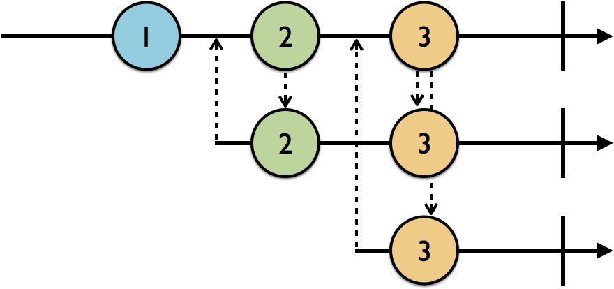
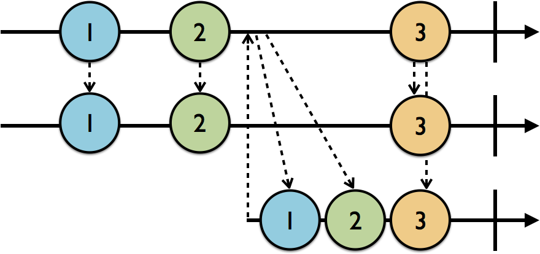

# Ch3 - Subjects
Observable이 RxSwift의 핵심이지만 보통 앱을 만들 때 필요한 것은 observable에 새로운 값을 더하는 것이다. 그것을 위해 observable과 observer 두 역할을 다 할 수 있는 **Subject**에 관해 볼 것이다.

## What are subjects?
observable과 observer의 역할을 동시에 수행한다.

다음과 같은 네 유형이 있다.
- `PublishSubject`: 비어 있는 채로 시작하고 새로운 원소만 subscribers에게 방출한다.
- `BehaviorSubject`: 초기값을 가진 채로 시작하고 그 값을 다시 방출하든지, 아니면 가장 최신 값을 새로운 subscriber에게 방출한다.
- `ReplaySubject`: 버퍼 사이즈로 초기화되고 그 사이즈까지 버퍼의 원소들을 유지하며 그것들을 새로운 subscriber에게 방출한다.
- `Variable`: `BehaviorSubject`를 래핑하며 상태값으로서 현재 값을 보존하고 최신/초기 값을 새로운 subscriber에게 방출한다.

## Working with publish subjects
PublishSubject는 구독된 순간 새로운 이벤트를 구독자에게 알리고 싶을 때 유용하다. 이 작업은 구독을 취소하거나, `.completed`나 `.error` 이벤트로 subject가 종료될 때까지 일어난다.

알아둘 것은 모든 Subject 타입이 한 번 종료되면, 새 구독이 되더라도 종료 이벤트를 다시 방출한다는 점이다.

## Working with behavior subjects
BehaviorSubject는 PublishSubject와 비슷하게 동작하지만 새로운 구독자에게 가장 최근의 `.next` 이벤트를 재방출한다는 점이 다르다.

> BehaviorSubject는 항상 최신 값을 방출하기 때문에 기본 초기값이 없는 채로 생성할 수 없다.

가장 최신의 이벤트를 구독을 시작하자마자 방출해주기 때문에 **가장 최신의 데이터로 뷰를 먼저 구성하고 싶을 때** 사용하면 좋다. 예를 들어 유저의 프로필 화면에서 최신의 값을 보여줄 때 사용한다.

그러나 만약 검색 화면에서 가장 최신의 값들을 5개까지 보여주고 싶으면 어떻게 해야 할까?

## Working with replay subjects
ReplaySubject는 그동안 방출한 이벤트 중 최신의 것들을 정한 특정 사이즈만큼 캐시(버퍼)시켜 놓는다. 이것들을 새로운 구독자에게 재방출한다.

ReplaySubject를 사용할 때 염두해야 할 점이 두 가지가 있다.
- 버퍼가 메모리에 유지되기 때문에 너무 큰 버퍼 사이즈를 유지할 경우 시스템적으로 좋지 않다.
- 배열의 ReplaySubject를 만드는 경우 사이즈가 크게 늘어나 시스템에게 부하를 준다.

또한, ReplaySubject가 `.error` 이벤트로 끝나도 disposed되지 않았다면 새로운 구독자가 생길 때 버퍼에 저장된 이벤트들이 재방출되고 이후 `.error` 이벤트를 방출한다.

## Working with variables
Variable은 **BehaviorSubject를 래핑하고 그것의 현재 값을 상태로 저장**한다. 현재 값을 `value` 프로퍼티로 접근이 가능하며 다른 subject나 observable과 달리 `value` 프로퍼티에 직접 새로운 값을 설정할 수 있고 대신 `onNext(_:)`를 사용할 수 없다.

BehaviorSubject를 매핑했기 때문에 초기값을 통해 생성되며 `asObservable()` 메서드를 통해 접근이 가능하다.

또 다른 특징은 `.error` 이벤트를 방출하지 않음을 보장한다는 점이다. 그래서 `.error` 이벤트를 Variable에 추가할 수 없다.

